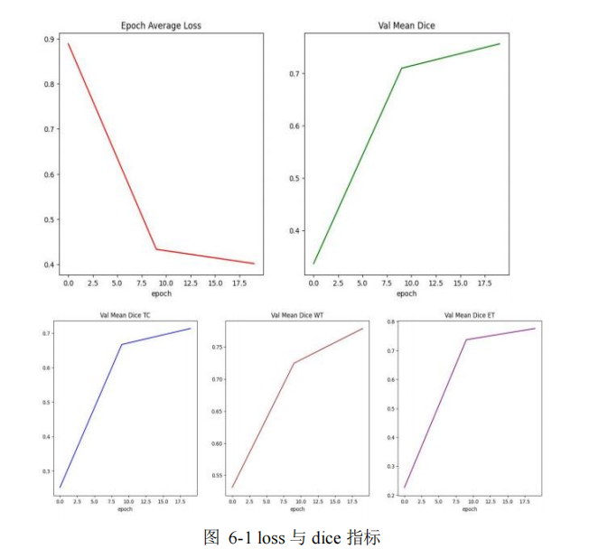
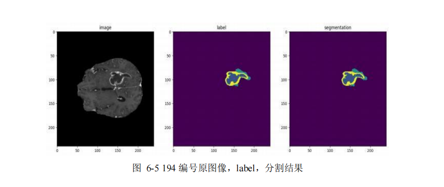
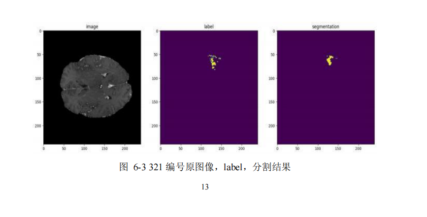
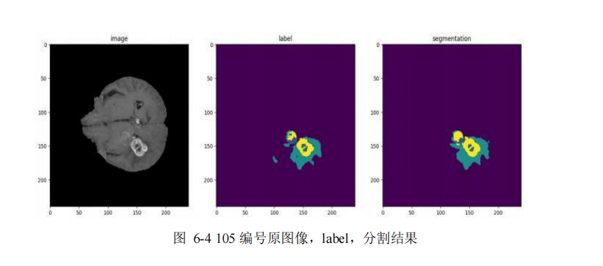
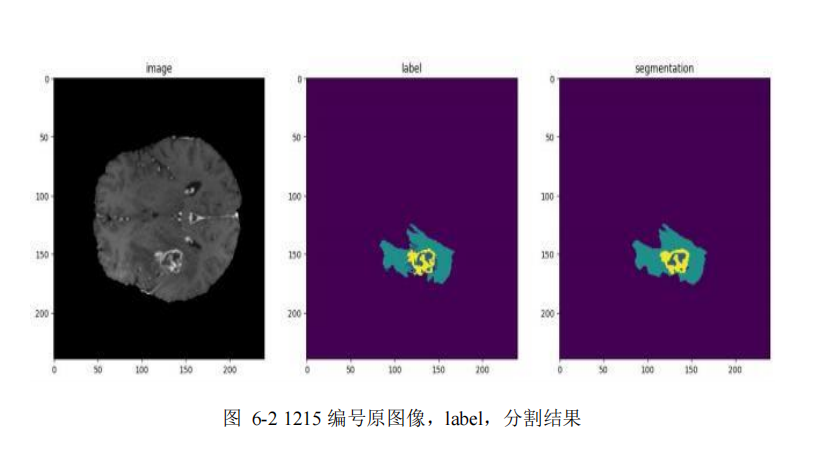

# 🧠 3D Brain Tumor Segmentation using Swin UNETR

📄 **[Click here to read the full Technical Report (PDF)](docs/Project_Report.pdf)**

## 📌 Project Overview
This project implements a high-precision 3D automatic segmentation system for brain tumors (WT, NCR, ED, ET) utilizing the **BraTS 2021** challenge dataset (1,666 multi-modal MRI scans). The core architecture is based on **Swin UNETR**, which leverages multi-layer windowed self-attention mechanisms for robust feature extraction.

## 💻 Tech Stack & Environment
- **Frameworks:** PyTorch, MONAI
- **Development Environment:** Local (Jupyter Notebook, Windows 11) -> Cloud (Microsoft Azure AI)
- **Cloud Deployment:** Initially faced local compute constraints (NVIDIA RTX 3050). To achieve optimal convergence, the training pipeline was successfully migrated to **Microsoft Azure AI**, scaling the training to 50 epochs over approximately 200 hours.

## ⚙️ Model Architecture & Data Engineering
- **Data Augmentation:** Implemented `RandSpatialCropd`, `RandFlipd`, `NormalizeIntensityd`, and `RandScaleIntensityd` via MONAI to enhance model robustness.
- **Loss Function:** `DiceLoss` (Soft Dice loss)
- **Optimizer:** AdamW with Cosine Annealing Learning Rate Scheduler.

## 📊 Results & Metrics
The model demonstrated excellent convergence and stability after 10 epochs. The loss steadily decreased, while the validation mean Dice coefficients plateaued at optimal levels.

**Final Validation Mean Dice Scores:**
* **WT (Whole Tumor):** ~0.78 (Outstanding segmentation of the entire tumor region)
* **ET (Enhancing Tumor):** ~0.72 (Strong detection of enhancing regions)
* **TC (Tumor Core):** ~0.70 (Solid performance in identifying the tumor core)

## 👁️ Segmentation Visualization
The following gallery demonstrates the model's inference performance across different test cases. Each image compares the **Raw MRI**, **Ground Truth (Label)**, and the **Swin UNETR Segmentation Output**.

| Test Case 01 | Test Case 02 |
| :---: | :---: |
|  |  |
| **Test Case 03** | **Test Case 04** |
|  |  |

## 📂 Repository Structure
- `train_evaluate.py`: The complete training, validation, and inference pipeline.
- `Project_Report.pdf`: Comprehensive documentation including detailed experimental setup and evaluation.
- *(Disclaimer: The BraTS dataset is not included in this repository due to size constraints. Please download it from the official MICCAI BraTS challenge website.)*
